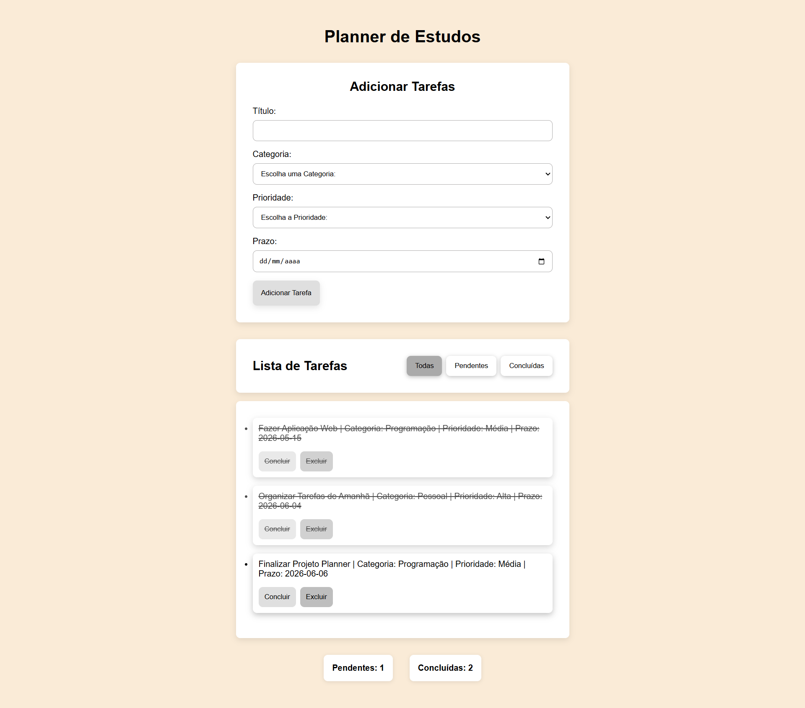
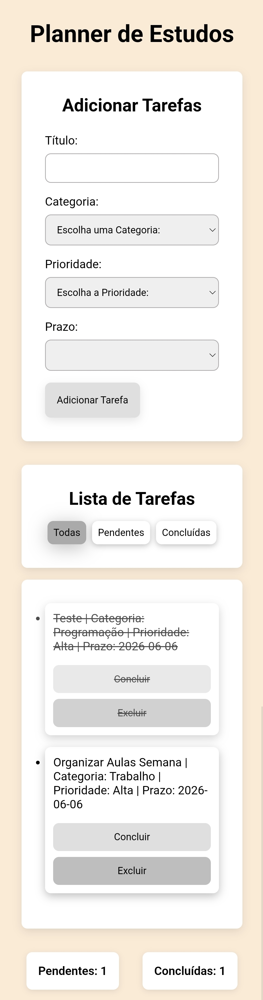

# Planner de Estudos

Aplicação web para gerenciamento de tarefas com filtros, contadores e armazenamento local.

Permite adicionar, concluir, excluir e filtrar tarefas por status.

## Funcionalidades

- Adicionar tarefas
- Remover tarefas
- Marcar como concluída
- Filtros (todas, pendentes, concluídas)
- Contadores de tarefas
- Salvamento no localStorage
- Interface responsiva

## Tecnologias

- HTML5
- CSS3
- JavaScript

## Como usar
1. Clone o repositório
2. Abra o arquivo index.html no navegador
3. Comece a adicionar tarefas

## Preview

## Desktop

## Mobile

